# AidFlow

**Transparent, conditional aid disbursement on Stellar/Soroban**

[](https://github.com/stellar-impact/aidflow/actions/workflows/contracts-ci.yml)
[](LICENSE)
[](https://stellar.org)

> Aid that moves only when the work is verified — and stays auditable at every step.

---

## The Problem

Humanitarian and development aid loses value to opacity. Once funds leave a donor,
tracing them to real outcomes is hard: intermediaries take undocumented cuts,
disbursement depends on trust rather than proof, and beneficiaries and funders alike
have little visibility into where money actually went. Reconciliation is manual,
slow, and after-the-fact.

AidFlow addresses this by making disbursement **conditional, programmable, and
publicly verifiable** — without putting personal data on a public ledger.

## The AidFlow Approach

NGOs fund milestone-gated escrows on Stellar. Funds for each milestone are released
only after independent field verification, and every asset movement is recorded
on-chain for anyone to audit. Beneficiaries receive stablecoin vouchers they can
claim and spend with approved merchants, who cash out to local fiat through Stellar
anchors. Personally identifiable information never touches the chain — only asset
movements and 32-byte evidence commitments do.

### How It Works

1. **Fund** — An NGO creates a program with defined milestones and funds the escrow in USDC.
2. **Attest** — A field oracle verifies a completed milestone and submits an evidence hash on-chain.
3. **Release** — An admin multisig releases funds for the *attested* milestone (and only that milestone).
4. **Claim** — Released funds flow to the voucher registry; beneficiaries claim vouchers via a pull model.
5. **Redeem** — Approved merchants accept vouchers and redeem them; anchors settle to local fiat.
6. **Audit** — Every movement is on-chain and independently verifiable, end to end.

### Key Features

- **Milestone-Gated Escrows** — Funds release only when field evidence is verified.
- **Two-Key Release** — Oracle attests, admin multisig releases: no single point of failure.
- **Voucher System** — Batch issuance, pull-based (lazy) claims, and expiry handling.
- **Merchant Integration** — Allowlisted merchant registry with SEP-24 anchor cash-out.
- **Privacy-First** — On-chain: asset movements and commitments only. Off-chain: encrypted PII.
- **Gas Efficient** — Batched operations and relayer fee sponsorship for beneficiaries.

### Two-Key Trust Model

AidFlow separates *verification* from *authorization*. The **oracle** can attest that a
milestone is complete but cannot move funds. The **admin multisig** can release funds
but only against a milestone that already carries a valid attestation. Neither key
alone can disburse aid, which removes the single point of failure that undermines
trust in traditional disbursement pipelines.

---

## Architecture

```mermaid
flowchart TD
    subgraph clients["Clients &mdash; planned"]
        DD["Donor Dashboard<br/>Vite + React"]
        BP["Beneficiary PWA<br/>Vite + React + Workbox"]
        MA["Merchant App<br/>Expo React Native"]
    end

    SDK["@aidflow/contract-sdk<br/>TypeScript &mdash; planned"]

    subgraph services["Services &mdash; Go &mdash; planned"]
        ON["onboarding"]
        OR["oracle"]
        IX["indexer"]
        RL["relayer"]
    end

    subgraph contracts["Contracts &mdash; Rust / soroban-sdk"]
        TYP["Types &#10003;"]
        CFG["Config &#10003;"]
        ESC["Escrow &#10003;"]
        VR["VoucherRegistry &#10003;"]
        MR["MerchantRegistry &#10003;"]
    end

    STELLAR["Stellar Network<br/>Testnet &rarr; Mainnet"]

    clients --> SDK --> services --> contracts --> STELLAR

    classDef built fill:#dcfce7,stroke:#16a34a,color:#14532d;
    classDef planned fill:#f1f5f9,stroke:#94a3b8,color:#475569,stroke-dasharray:4 3;

    class TYP,CFG,ESC,VR,MR built;
    class ON,OR,IX,RL,SDK,DD,BP,MA planned;
```



> **Status legend:** &#10003; implemented and tested &nbsp;·&nbsp; &#128679; scaffolded, not yet implemented &nbsp;·&nbsp; dashed = planned.
> Only the contract layer (`Types`, `Config`, `Escrow`) is built and CI-verified today; the SDK, services, and clients are on the roadmap below.

The codebase is a **modular monorepo** with a strict, one-directional dependency rule:
contracts depend only on `soroban-sdk`; services and clients consume contracts through
published packages (`aidflow-contract-types`, `@aidflow/contract-sdk`), never through
relative paths. This boundary is enforced in CI so the contract layer can be extracted
into its own repository after audit without churn. See
[docs/ARCHITECTURE.md](docs/ARCHITECTURE.md) and
[docs/EXTRACTION_PLAN.md](docs/EXTRACTION_PLAN.md).

---

## Smart Contracts

The contract layer is the heart of AidFlow and the most mature part of the codebase.
It is written in Rust against `soroban-sdk`, built for the `wasm32v1-none` target, and
validated by a full CI suite (format, Clippy with `-D warnings`, tests, and optimized
WASM builds) on every push.

| Contract | Crate | Status | Role |
|----------|-------|--------|------|
| **Types** | `aidflow-contract-types` | ✅ Implemented | Shared, stable types consumed across the workspace |
| **Config** | `aidflow-config` | ✅ Implemented | Admin/oracle registry, pause circuit-breaker, instance-storage keys with TTL management |
| **Escrow** | `aidflow-escrow` | ✅ Implemented | Programs, milestones, funding, two-key attest/release, unspent refund |
| **VoucherRegistry** | `aidflow-voucher-registry` | ✅ Implemented | Admin-gated batch issuance (max 40), pull-based claims, permissionless expiry back to Escrow |
| **MerchantRegistry** | `aidflow-merchant-registry` | ✅ Implemented | Merchant allowlist, redemption to payout address, category tagging |

### Engineering Safeguards

The Escrow contract is written to a deliberately conservative standard, because it
custodies funds:

- **Per-milestone release state** — each milestone tracks its own released flag, so a
  milestone can never be released twice, and releasing one never unlocks another.
- **Attestation-bound release** — `release` requires a stored attestation record for
  the exact program/milestone pair; funds cannot move for unverified work.
- **Checks-Effects-Interactions ordering** — state is updated before any token
  transfer, closing reentrancy-style windows.
- **Checked arithmetic** — all balance math uses `checked_add`/`checked_sub`; the
  release profile also enables `overflow-checks`.
- **Pause circuit-breaker** — a Config-level pause blocks *every* state-changing call,
  including oracle attestation, so an incident can be contained even if a key is
  compromised.
- **Cross-contract auth** — Escrow reads admin/oracle/paused state from Config at call
  time, keeping a single source of truth for authorization.
- **TTL management** — instance and persistent entries are bumped on access to prevent
  state archival of live programs.

See [docs/CONTRACT_INTERFACES.md](docs/CONTRACT_INTERFACES.md) for the full API.

---

## Quick Start

### Prerequisites

- **Rust** 1.85+ with the `wasm32v1-none` target (`rustup target add wasm32v1-none`)
- **stellar-cli** 27.x (`cargo install --locked stellar-cli --version '^27'`)
- **Node.js** 20+ (for clients and the TypeScript SDK)
- **Go** 1.23+ (for backend services)
- **Docker** & **Docker Compose** (for the full local stack)

> The contracts build and test with the Rust toolchain alone. Node, Go, and Docker are
> only needed for the services, clients, and local stack.

### Build and Test the Contracts

This is the fastest path to a green checkout — no external services required:

```bash
git clone https://github.com/stellar-impact/aidflow.git
cd aidflow/contracts

# Run the full workspace test suite (115 tests across types, config, escrow, voucher and merchant registries)
cargo test --all

# Optimized WASM build for all contracts
./scripts/build.sh
# → target/wasm32v1-none/release/aidflow_config.wasm
# → target/wasm32v1-none/release/aidflow_escrow.wasm (plus the two registries)
```

### Testnet Deployment

All four contracts are live on Stellar testnet (deployed with `contracts/scripts/deploy-testnet.sh`):

| Contract | ID |
|----------|----|
| Config | [`CDXXC6Z3Z4ARBISFFRBUEXF7ICJXMPKYGYRW6CJNRNLD3UDOF2IOLQ26`](https://stellar.expert/explorer/testnet/contract/CDXXC6Z3Z4ARBISFFRBUEXF7ICJXMPKYGYRW6CJNRNLD3UDOF2IOLQ26) |
| Escrow | [`CDNQEFNHJRXTTSHTOQUY6WTT7VKSEX2E5WWMU6LIJCTH3G4FDMBYXNEV`](https://stellar.expert/explorer/testnet/contract/CDNQEFNHJRXTTSHTOQUY6WTT7VKSEX2E5WWMU6LIJCTH3G4FDMBYXNEV) |
| VoucherRegistry | [`CC6NOTJ5OYTB7TG37OSK3PLOQ2MICDYVGZE4OVJKT7NIN4MZ5TTU4F74`](https://stellar.expert/explorer/testnet/contract/CC6NOTJ5OYTB7TG37OSK3PLOQ2MICDYVGZE4OVJKT7NIN4MZ5TTU4F74) |
| MerchantRegistry | [`CBCM6CVJ3BPHUDTNCQNFIG3MK7VRXNJBPCMVDIMKHJ2BVIG3MPF2LBTL`](https://stellar.expert/explorer/testnet/contract/CBCM6CVJ3BPHUDTNCQNFIG3MK7VRXNJBPCMVDIMKHJ2BVIG3MPF2LBTL) |

The flow has been exercised on-chain: create program, fund, oracle attestation, admin
release to the voucher registry, batch voucher issuance, a claim, an expiry that returned
funds to Escrow and re-credited the program, and merchant registration, redemption and
deactivation.

Testnet-only caveats: the settlement token is the native XLM asset contract (not USDC), and
admin and oracle are throwaway testnet identities.

### Full Workspace

From the repository root:

```bash
make install     # install JS/Go dependencies across the workspace
make test        # run tests across contracts, services, and clients
make lint        # format + lint every module
make build       # build every module
make check-boundaries   # enforce the dependency-direction rule
```

Run `make help` to see all available targets.

### Local Stack

The full local environment (Stellar quickstart, Postgres, Redis, object storage, and
services) is orchestrated with Docker Compose:

```bash
make docker-up      # start the stack
make docker-logs    # tail logs
make docker-down    # stop the stack
```

---

## Repository Structure

```
aidflow/
├── contracts/               # Soroban smart contracts (Rust)
│   ├── types/               # Shared, stable types
│   ├── config/              # Admin/oracle registry + pause circuit-breaker
│   ├── escrow/              # Programs, milestones, funding, two-key release
│   ├── voucher_registry/    # Batch issuance, claims, expiry
│   ├── merchant_registry/   # Allowlist, redemption
│   └── sdk/                 # @aidflow/contract-sdk (TypeScript bindings)
├── services/                # Backend services (Go)
│   ├── cmd/
│   │   ├── indexer/         # Horizon event stream → Postgres
│   │   ├── relayer/         # Fee-bump sponsorship
│   │   ├── onboarding/      # Beneficiary import + PII encryption
│   │   └── oracle/          # Evidence upload → attestation
│   └── internal/
├── clients/                 # Web & mobile apps
│   ├── donor-dashboard/     # Vite + React + TypeScript
│   ├── beneficiary-pwa/     # Offline-capable PWA (Workbox + passkey)
│   └── merchant-app/        # Expo React Native (QR scanner)
├── infra/                   # Infrastructure as Code
│   ├── docker-compose.yml   # Full local stack
│   └── k8s/                 # Kubernetes + Kustomize overlays
├── docs/                    # Architecture, interfaces, ADRs, security
└── scripts/                 # Development & CI scripts
```

---

## Documentation

- [**Architecture**](docs/ARCHITECTURE.md) — System design and data flow
- [**Contract Interfaces**](docs/CONTRACT_INTERFACES.md) — Soroban API reference
- [**API Documentation**](docs/API.md) — Services API specs
- [**Extraction Plan**](docs/EXTRACTION_PLAN.md) — Modular monorepo → multi-repo strategy
- [**Security Policy**](docs/SECURITY.md) — Audit checklist and vulnerability reporting
- [**ADRs**](docs/adr/) — Architecture Decision Records

---

## Contributing

Contributions are welcome. Please read the [**Contributing Guide**](CONTRIBUTING.md)
before opening a pull request.

### Development Workflow

1. **Fork** the repository.
2. **Branch** from `main`: `git checkout -b feature/your-feature`.
3. **Make changes** following the existing style and conventions.
4. **Verify locally**: `make test && ./scripts/check-boundaries.sh`.
5. **Commit** with clear, descriptive messages.
6. **Open a PR** — CI must pass before it can merge.

> **Using AI agents to complete issues?** See the
> [AI Agent Guidelines](CONTRIBUTING.md#using-ai-agents-to-complete-issues) for the
> version-pinning and verification requirements that keep CI green.

Browse the [open issues](https://github.com/stellar-impact/aidflow/issues) to find
something to work on — each is tagged by complexity in its title.

---

## Tech Stack

| Layer | Technology | Version |
|-------|-----------|---------|
| **Smart Contracts** | Rust + soroban-sdk | 26.1+ |
| **Build Tool** | stellar-cli | 27.x |
| **WASM Target** | `wasm32v1-none` | — |
| **Backend Services** | Go | 1.23+ |
| **Stellar SDK (Go)** | github.com/stellar/go-stellar-sdk | Latest |
| **Frontend (Web)** | Vite + React + TypeScript | Latest |
| **Mobile** | Expo React Native | Latest |
| **Data** | Postgres, Redis, S3-compatible storage | — |
| **Infrastructure** | Docker Compose, Kubernetes + Kustomize | — |

> See [docs/AIDFLOW_MASTER_PROMPT.md](docs/AIDFLOW_MASTER_PROMPT.md) §0.5 for exact
> pinned versions and anti-drift guards.

---

## Roadmap

**MVP — Core Contracts**
- Config contract: admin/oracle registry + pause circuit-breaker
- Escrow contract: milestone-gated funding, two-key attest/release, unspent refund
- VoucherRegistry + MerchantRegistry contracts
- Indexer, oracle, and onboarding services
- Donor dashboard + beneficiary PWA
- Local dev stack (Docker Compose) and testnet deployment

**Beta**
- Merchant app (QR scanner) and SEP-24 anchor integration (cash-out)
- GraphQL API with subscriptions
- End-to-end test suite (Playwright)
- Prometheus metrics + Grafana dashboards

**Audit Prep**
- Security audit (contracts + services)
- Contract extraction to a dedicated `aidflow-contracts` repository
- Mainnet deployment preparation, load testing, and chaos engineering

---

## Security

AidFlow custodies funds and handles sensitive beneficiary data, so security is a
first-class concern. On-chain state is limited to asset movements and 32-byte evidence
commitments — never personal data. The contract layer is built around a two-key trust
model, a global pause circuit-breaker, and conservative, checked accounting.

To report a vulnerability, please follow the process in
[docs/SECURITY.md](docs/SECURITY.md). Please do not open public issues for security
reports.

---

## License

Copyright 2026 Stellar Impact.

Licensed under the Apache License, Version 2.0. You may obtain a copy of the License at
<http://www.apache.org/licenses/LICENSE-2.0>.

Unless required by applicable law or agreed to in writing, software distributed under
the License is distributed on an "AS IS" BASIS, WITHOUT WARRANTIES OR CONDITIONS OF ANY
KIND, either express or implied. See the [LICENSE](LICENSE) file for the specific
language governing permissions and limitations.

---

## Links

- **Repository:** <https://github.com/stellar-impact/aidflow>
- **Stellar Developers:** <https://developers.stellar.org>
- **Soroban Docs:** <https://developers.stellar.org/docs/build/smart-contracts>

---

*Built for transparent, accountable aid distribution on Stellar.*


